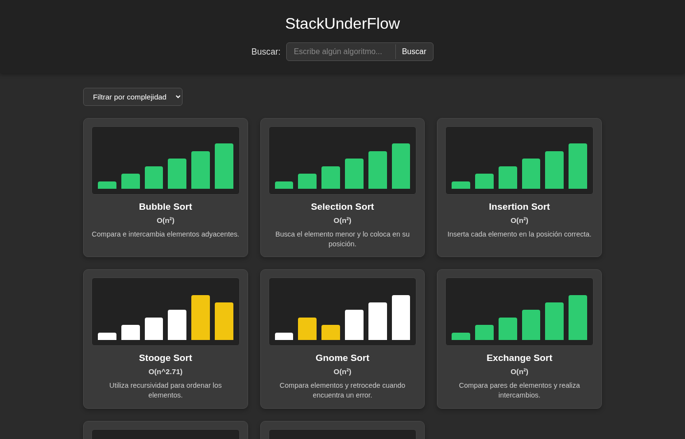
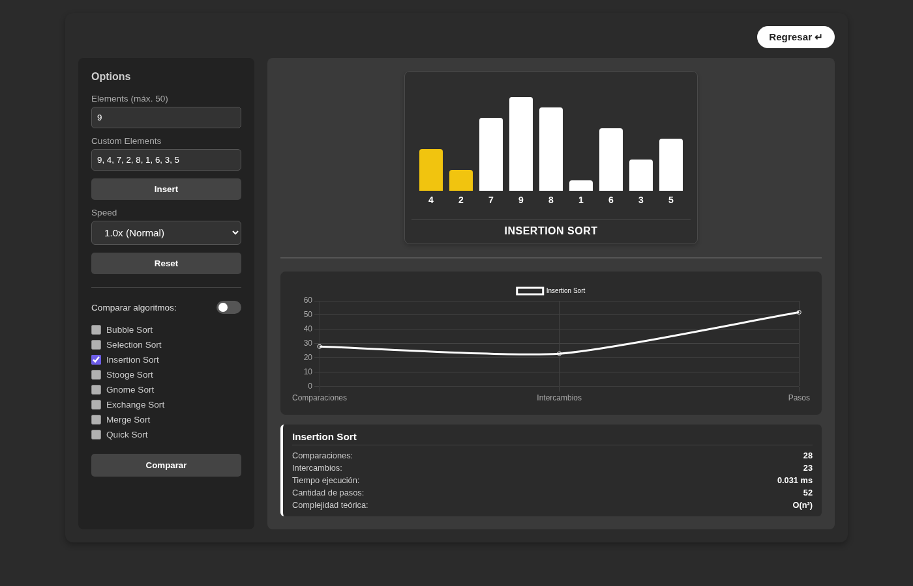
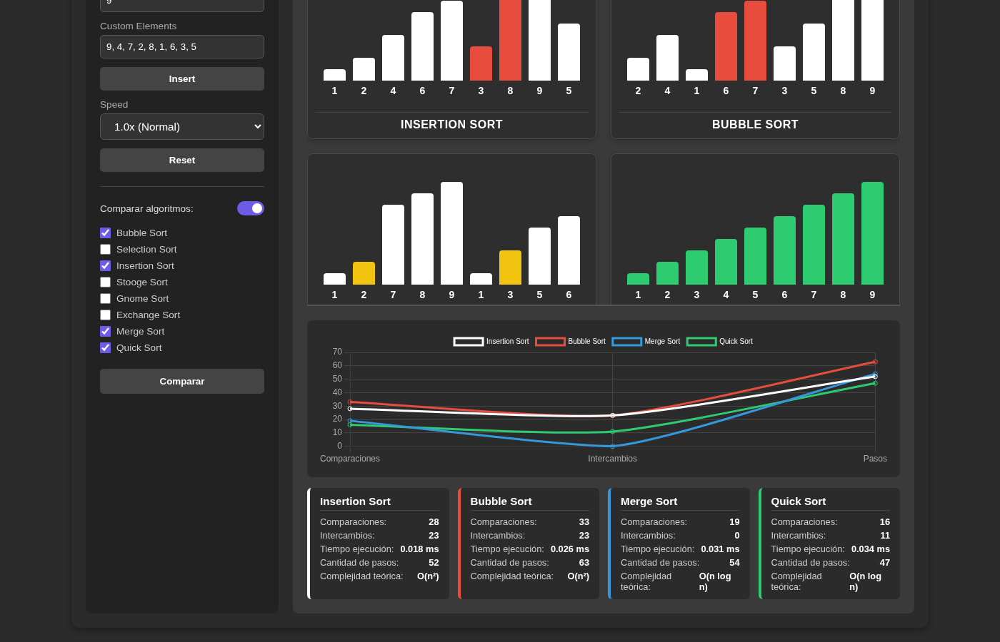

# Stack Underflow — Visualizador web de algoritmos de ordenamiento

Aplicación web para visualizar, ejecutar y comparar ocho algoritmos de ordenamiento paso a paso.

Este repositorio contiene el **backend** (API). El frontend está en [algorithms-visualization-frontend](https://github.com/qci-stack-underflow/algorithms-visualization-frontend).

| | |
|---|---|
| **Aplicación publicada** | https://stack-underflow-frontend-algviz.vercel.app |
| **API publicada** | https://stack-underflow-backend-algviz.vercel.app |
| **Repositorio frontend** | https://github.com/qci-stack-underflow/algorithms-visualization-frontend |
| **Repositorio backend** | https://github.com/qci-stack-underflow/algorithms-visualization-backend |
| **GitHub Projects** | https://github.com/orgs/qci-stack-underflow/projects/1 |



## Integrantes

| Integrante | Usuario de GitHub | Área |
|---|---|---|
| Arath Josué Campos Gutiérrez | [`arcamp0130`](https://github.com/arcamp0130) | Backend |
| Salvador Ramos García | [`SalvadorRGDev`](https://github.com/SalvadorRGDev) | Backend |
| Edwin Juan Pablo Guzmán Mendoza | [`edguzsv`](https://github.com/edguzsv) | Frontend |
| Alessandra Rodriguez Piz | [`alesspiz`](https://github.com/alesspiz) | Frontend |

Materia: Análisis de Algoritmos — Sección D01 — Ciclo 2026B.

## Descripción

El visualizador permite elegir un algoritmo de ordenamiento, generar o escribir un arreglo de números y ver cómo el algoritmo lo ordena: qué elementos compara, cuáles intercambia y cómo cambia el arreglo hasta quedar ordenado. También permite ejecutar varios algoritmos sobre el mismo arreglo y comparar su comportamiento con métricas (comparaciones, intercambios, pasos, tiempo de ejecución y complejidad teórica).

Los algoritmos se ejecutan en el backend, que registra cada operación como un *paso*. El frontend recibe esos pasos y los anima con un código de colores.

## Objetivo

Ayudar a entender visualmente cómo funciona cada algoritmo de ordenamiento visto en clase y comparar su eficiencia de forma práctica, aplicando el ciclo completo de desarrollo: implementar, visualizar, comparar, documentar, colaborar y publicar.

## Algoritmos implementados

| Algoritmo | Mejor caso | Caso promedio | Peor caso | Idea principal |
|---|---|---|---|---|
| Bubble Sort | O(n) | O(n²) | O(n²) | Intercambia elementos adyacentes; termina antes si una pasada no intercambia nada |
| Selection Sort | O(n²) | O(n²) | O(n²) | Busca el mínimo de lo que falta y lo coloca al frente |
| Insertion Sort | O(n) | O(n²) | O(n²) | Desliza cada elemento hacia la izquierda hasta su lugar en la parte ya ordenada |
| Stooge Sort | O(n^2.71) | O(n^2.71) | O(n^2.71) | Ordena recursivamente los primeros 2/3, los últimos 2/3 y otra vez los primeros 2/3 |
| Gnome Sort | O(n) | O(n²) | O(n²) | Avanza si el par está en orden; si no, intercambia y retrocede |
| Exchange Sort | O(n²) | O(n²) | O(n²) | Compara cada posición con todas las de su derecha |
| Merge Sort | O(n log n) | O(n log n) | O(n log n) | Divide el arreglo, ordena cada mitad y las mezcla |
| Quick Sort | O(n log n) | O(n log n) | O(n²) | Partición de Lomuto: el pivote (último elemento) queda en su lugar final |

El código de cada algoritmo está en [`src/algorithms/definitions/`](https://github.com/qci-stack-underflow/algorithms-visualization-backend/tree/main/src/algorithms/definitions) del backend: un archivo por algoritmo con su ficha (`info`) y su función `sort(t)`.

## Tecnologías utilizadas

| Backend | Frontend |
|---|---|
| Node.js + TypeScript | Vite |
| NestJS 11 (con `@nestjs/config`) | JavaScript (módulos ES, sin framework) |
| Jest y Supertest (pruebas unitarias y e2e) | SASS |
| pnpm | Chart.js (gráfica de métricas) |
| | pnpm |

**Publicación:** Vercel (plan gratuito), con un proyecto independiente para el frontend y otro para el backend.

## Cómo ejecutar el proyecto

Requisitos: Node.js 22 o superior y pnpm.

### Backend (este repositorio)

```bash
git clone https://github.com/qci-stack-underflow/algorithms-visualization-backend.git
cd algorithms-visualization-backend
pnpm install
cp .env.example .env     # opcional: define PORT (por defecto 3000)
pnpm start:dev           # http://localhost:3000
```

Pruebas:

```bash
pnpm test                # 127 pruebas unitarias
pnpm test:e2e            # pruebas end-to-end
```

Producción:

```bash
pnpm build
pnpm start:prod
```

### Frontend

Las instrucciones están en el [README del frontend](https://github.com/qci-stack-underflow/algorithms-visualization-frontend#cómo-ejecutar-el-proyecto). En resumen: `pnpm install` y `pnpm dev` (http://localhost:3030); por defecto usa este backend corriendo en el puerto 3000.

## Uso de la aplicación

1. En la pantalla de inicio, cada tarjeta muestra una animación corta de su algoritmo. Se puede **buscar** por nombre o **filtrar** por complejidad.
2. Al hacer clic en una tarjeta se abre el **visualizador**.
3. En el panel **Options** se genera un arreglo aleatorio (**Elements**, máximo 50) o se escribe uno propio (**Custom Elements** + **Insert**).
4. Se elige la velocidad (**Speed**).
5. **Comparar** ejecuta la simulación. Las barras cambian de color según la operación:

   | Color | Significado |
   |---|---|
   | Amarillo | Comparación |
   | Rojo | Intercambio |
   | Morado | Escritura (Merge Sort) |
   | Azul | Pivote (Quick Sort) |
   | Verde | Arreglo ordenado |

6. Para comparar, se activa **Comparar algoritmos** y se marcan dos o más: todos se ejecutan sobre el mismo arreglo y se animan a la vez.
7. Las métricas aparecen en las tarjetas y en la gráfica.
8. **Reset** regresa al estado inicial y **Regresar** vuelve al inicio.

### Capturas

**Visualización de un algoritmo** (Insertion Sort comparando dos posiciones):



**Comparación de cuatro algoritmos** sobre el mismo arreglo, con la gráfica y las métricas:



## Deployment

| | URL | Proyecto en Vercel |
|---|---|---|
| Frontend | https://stack-underflow-frontend-algviz.vercel.app | `stack-underflow-frontend-algviz` |
| Backend | https://stack-underflow-backend-algviz.vercel.app | `stack-underflow-backend-algviz` |

- Ambos repositorios están conectados a Vercel: cada cambio en `main` se publica automáticamente y cada pull request genera un despliegue de prueba.
- **Backend:** `vercel.json` compila `src/main.ts` con `@vercel/node` y envía todas las rutas (`GET`, `POST` y `OPTIONS` para el preflight de CORS) a la aplicación de Nest.
- **Frontend:** preset de Vite (carpeta de salida `dist`) con la variable `VITE_API_URL` apuntando a la API publicada.
- Todo se publica con el plan gratuito de Vercel.

## Organización del equipo

- **Tablero:** [GitHub Projects](https://github.com/orgs/qci-stack-underflow/projects/1) con las columnas Backlog, Ready, In progress, In review y Done. Cada tarea indica qué se hará, responsable, fecha y criterio de terminado.
- **Ramas:** `main` (versión publicada, solo recibe merges de `dev`), `dev` (integración) y ramas personales `{usuario}/...` que llegan a `dev` mediante pull requests revisados por otro integrante.
- **Sprints:** Sprint 1 (26–30 de septiembre) y Sprint 2 (1–4 de octubre).

### Responsabilidades

| Integrante | Responsabilidades |
|---|---|
| Arath | Configuración del proyecto NestJS, Jest y alias de rutas; organización de módulos; rutas del API, validaciones y manejo de errores HTTP; base del proyecto Vite; configuración y despliegue en Vercel de ambos repositorios |
| Salvador | Formato de entrada y salida de los algoritmos (pasos y métricas); tracer y `runAlgorithm`; servicio de algoritmos; implementación de los 8 algoritmos; pruebas con 3 tamaños de entrada; integración del frontend con el backend (cliente de la API, adaptador de pasos y vista previa animada de las tarjetas); revisión de pull requests |
| Edwin | Motor de animación (reproducción de pasos, velocidad, reinicio y colores de las barras) |
| Alessandra | Diseño de la interfaz: pantalla de inicio, búsqueda y filtro, tarjetas, visualizador, panel de opciones, modo comparar, gráfica y tarjetas de métricas |

## Uso de IA

| Herramienta | Para qué se usó |
|---|---|
| Claude | Apoyo para generar código y pruebas, resolver errores, revisar cambios y automatizar commits y pull requests |

Todo el código generado con apoyo de IA fue revisado y probado por el equipo, que es responsable de él.

## Aprendizajes y conclusiones

**Arath.** Configurar el backend con Nest fue más laborioso de lo que esperaba, sobre todo la parte de Jest y los alias de rutas. Lo que más tiempo me llevó fue el deploy en Vercel: varias veces compilaba sin errores pero no respondía, y tuve que ir probando hasta dar con la configuración correcta. Me quedo con que una cosa es que funcione en local y otra muy distinta que funcione publicado.

**Salvador.** No tenía experiencia con Git ni con páginas web, y al principio no entendía bien cómo se conectaban el frontend y el backend. Diseñar el formato de los pasos me ayudó a ver cada algoritmo como una serie de operaciones pequeñas que se pueden contar y animar. También aprendí a trabajar con ramas y pull requests, y a revisar el código de mis compañeros antes de unirlo.

**Edwin.** El motor de animación lo empecé en React, pero tuve que pasarlo a JavaScript normal para que coincidiera con lo que ya tenía el equipo. Fue frustrante rehacerlo, aunque terminó siendo más sencillo de lo que pensaba. Entendí mejor cómo funciona `setInterval` y cómo cambiar el aspecto de una barra según lo que esté haciendo el algoritmo.

**Alessandra.** Me tocó la parte visual, así que estuve trabajando mucho con HTML, SASS y la gráfica de Chart.js. Hacer que las pantallas se vieran bien en computadora y en celular costó más de lo que imaginaba. Algo que haría diferente es subir mis avances antes, porque al integrarlo todo al final hubo cosas repetidas con lo de Edwin.

**Conclusión del equipo.** El proyecto nos sirvió para ver los algoritmos de ordenamiento de otra forma: no solo como código, sino como pasos que se pueden observar y comparar. Notamos que la diferencia entre O(n²) y O(n log n) se vuelve muy clara al ver cuántas comparaciones hace cada uno con el mismo arreglo. La organización fue lo más difícil; varias partes se unieron tarde y eso complicó la integración, pero al final logramos tener todo funcionando y publicado.

## Documentación técnica del backend

### Endpoints

| Método | Ruta | Cuerpo | Respuesta |
|---|---|---|---|
| GET | `/algorithms` | — | Ficha de los 8 algoritmos (nombre, complejidad, descripción y pseudocódigo) |
| GET | `/algorithms/:id` | — | Ficha de un algoritmo; 404 si no existe |
| POST | `/algorithms/:id/run` | `{ "input": number[] }` | Resultado con pasos y métricas |
| POST | `/algorithms/compare` | `{ "algorithms": string[], "input": number[] }` | Un resultado por algoritmo, sobre el mismo arreglo |
| GET | `/checkhealth` | — | Estado del servidor |

Errores: 400 si la entrada no es válida (no son números, más de 50 elementos, menos de dos algoritmos o algoritmos repetidos) y 404 si el algoritmo no existe.

### Formato de los algoritmos

Cada algoritmo recibe un arreglo de números y devuelve el arreglo ordenado, la lista de **pasos** que el frontend reproduce como animación y las **métricas** para la comparación. Los tipos están en [`src/types/algorithm.types.ts`](src/types/algorithm.types.ts) y el motor en [`src/algorithms/utils/algorithm.tracer.ts`](src/algorithms/utils/algorithm.tracer.ts).

**Entrada:** un arreglo de números finitos (`NaN` e `Infinity` no se aceptan), con un máximo de **50 elementos** (`MAX_INPUT_LENGTH`) para que las respuestas no rebasen el límite de tamaño de Vercel.

**Pasos:** cada paso describe solo lo que cambia. El frontend parte de `input` y aplica `swap` y `write` en orden para reconstruir el arreglo en cualquier momento. `line` es el índice de la línea de `pseudocode` que se está ejecutando.

| Tipo | Datos | Significado | Lo usan |
|---|---|---|---|
| `compare` | `indices: [i, j]`, `line` | Se comparan las posiciones `i` y `j` | Todos |
| `swap` | `indices: [i, j]`, `line` | Se intercambian `i` y `j` | Todos menos Merge |
| `write` | `index`, `value`, `line` | Se escribe `value` en `index` | Merge |
| `pivot` | `index`, `line` | Pivote actual | Quick |
| `range` | `start`, `end`, `line` | Subarreglo activo | Merge, Quick |
| `sorted` | `indices` | Posiciones ya en su lugar final | Todos (al final, automático) |

**Ejemplo real** de Insertion Sort con `[3, 1, 2]`:

```json
{
  "algorithm": "insertion-sort",
  "input": [3, 1, 2],
  "output": [1, 2, 3],
  "steps": [
    { "type": "compare", "indices": [0, 1], "line": 2 },
    { "type": "swap", "indices": [0, 1], "line": 3 },
    { "type": "compare", "indices": [1, 2], "line": 2 },
    { "type": "swap", "indices": [1, 2], "line": 3 },
    { "type": "compare", "indices": [0, 1], "line": 2 },
    { "type": "sorted", "indices": [0, 1, 2] }
  ],
  "metrics": { "comparisons": 3, "swaps": 2, "writes": 0, "steps": 6, "executionTimeMs": 0.0026 }
}
```

### Cómo se escribe un algoritmo

Cada algoritmo es un archivo en `src/algorithms/definitions/` que exporta un objeto `AlgorithmDefinition` con su ficha (`info`) y una función `sort(t)`. El algoritmo no modifica el arreglo directamente: usa el tracer `t`, que hace la operación, la registra como paso y la cuenta en las métricas.

```ts
export const insertionSort: AlgorithmDefinition = {
  info: {
    id: 'insertion-sort',
    name: 'Insertion Sort',
    complexity: { best: 'O(n)', average: 'O(n²)', worst: 'O(n²)' },
    description: 'Inserción en la parte ya ordenada',
    pseudocode: [
      'for i = 1 to n-1',
      '  j = i',
      '  while j > 0 and A[j-1] > A[j]',
      '    swap(A[j-1], A[j])',
      '    j = j - 1',
    ],
  },
  sort(t) {
    for (let i = 1; i < t.length; i += 1) {
      let j = i;
      while (j > 0 && t.compare(j - 1, j, 2) > 0) {
        t.swap(j - 1, j, 3);
        j -= 1;
      }
    }
  },
};
```

| Operación | Método del tracer |
|---|---|
| Comparar dos posiciones | `t.compare(i, j, line)`: devuelve `< 0`, `0` o `> 0` |
| Comparar valores fuera del arreglo (Merge) | `t.compareValues(a, b, [i, j], line)` |
| Intercambiar | `t.swap(i, j, line)` |
| Escribir un valor | `t.write(i, value, line)` |
| Leer sin comparar | `t.array[i]` |
| Avisos para la animación | `t.pivot(i, line)`, `t.range(start, end, line)`, `t.sorted(indices)` |

Para agregar un algoritmo se crea su archivo y se añade a `ALGORITHM_DEFINITIONS` en [`src/algorithms/utils/algorithms.registry.ts`](src/algorithms/utils/algorithms.registry.ts); las pruebas de `algorithms.spec.ts` lo cubren automáticamente.

### Ejecución y métricas

`runAlgorithm(definition, input)` valida la entrada y ejecuta el algoritmo dos veces sobre copias de `input`:

1. Con `RecordingTracer`: obtiene los pasos, los contadores y el arreglo ordenado.
2. Con `CountingTracer`: no guarda pasos y mide el tiempo con `performance.now()`.

| Métrica | Dónde se calcula |
|---|---|
| `comparisons` | `CountingTracer.compareValues` |
| `swaps` | `CountingTracer.swap` |
| `writes` | `CountingTracer.write` |
| `steps` | Tamaño de la lista de pasos |
| `executionTimeMs` | `runAlgorithm`, en la segunda ejecución |

### Capas

`AlgorithmsController` recibe las peticiones, valida el cuerpo y traduce los errores a respuestas HTTP. `AlgorithmsService` busca el algoritmo por su id en el registro y lo ejecuta con `runAlgorithm`; si algo falla, lanza un `Error` con una causa (`unknown-id`, `bad-array`, `bad-ids` o `algorithms-repeat`) que el controlador convierte en 404 o 400.

### Pruebas

- `algorithms.spec.ts`: los 8 algoritmos con casos borde (vacío, un elemento, repetidos, negativos, ordenado, inverso y decimales), **3 tamaños de entrada (10, 25 y 50)**, reproducción de los pasos sobre `input` y métricas contra pasos.
- `algorithms.service.spec.ts` y `algorithms.controller.spec.ts`: el servicio y el controlador, incluidos los errores.
- `test/app.e2e-spec.ts`: prueba end-to-end de la aplicación.
